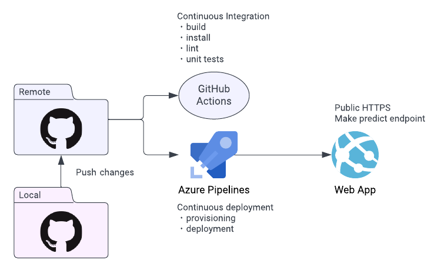
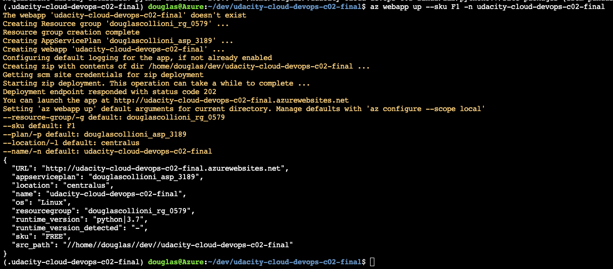
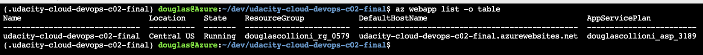
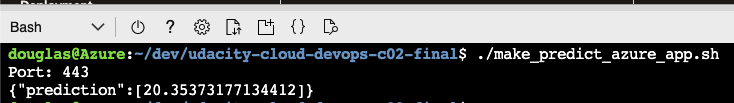
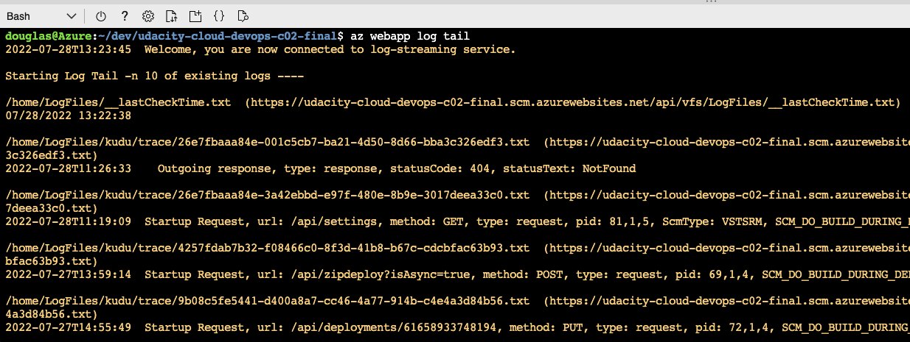
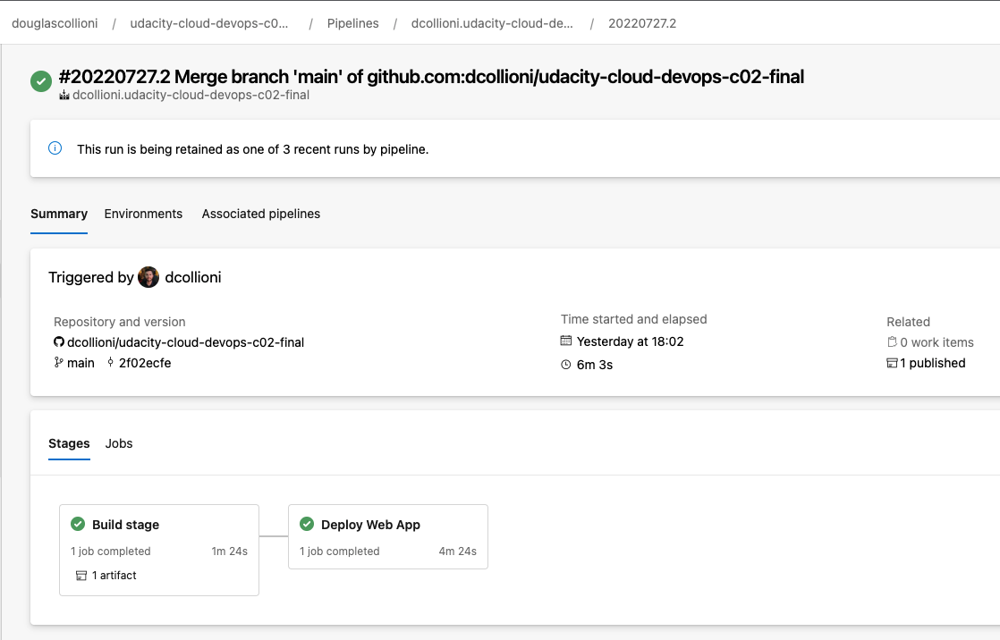

# Udacity Cloud DevOps - Course 02 - Final Project

## Overview
Flask ML Web App deployed on Azure with CI/CD

## Project Plan and Task Tracking
- [Project plan spreadsheet](https://docs.google.com/spreadsheets/d/1p29UxxCbZ4jmfiDiYAPbk6N9hc05gtVK5Gno8hvmO3c)
- [Task tracking Trello board](https://trello.com/b/iziwVR8V/build-a-ci-cd-pipeline)

## Azure Cloud Shell
1. Repository cloned on Azure Cloud Shell
    

## Architectural Diagram
The following diagram shows the CI/CD process:



## Instructions
1. Create a Python virtual environment:
    ```sh
    make setup
    ```

1. Activate the virtual environment:
    ```sh
    source ~/.udacity-cloud-devops-c02-final/bin/activate
    ```

1. Deactivate the virtual environment:
    ```sh
    deactivate
    ```

## Install, Lint and Test
1. Run install, lint and tests:
    ```sh
    make all
    ```

    The result should look like this:
    

## Azure Web App
1. Create the Azure Web App:

    ```sh
    az webapp up --sku F1 -n udacity-cloud-devops-c02-final
    ```

1. The result of a successful web app deployment should look like this:

    

1. Check the Web App:

    ```sh
    az webapp list -o table
    ```

1. The Web App created should be listed in the results like this:

    

1. The app will be available at the URL:

    - https://udacity-cloud-devops-c02-final.azurewebsites.net

1. Making a predict:

    ```sh
    ./make_predict_azure_app.sh
    ```

    The predict result should look like this:

    

### Logs
1. Inspect the logs from the running application:

    https://udacity-cloud-devops-c02-final.scm.azurewebsites.net/api/logs/docker

1. Alternatively, the logs can be streamed:
    
    ```sh
    az webapp log tail
    ```

    The log tail should look like this:

    

## GitHub Action Build
1. The app build is setup on the GitHub Actions:
    - https://github.com/dcollioni/udacity-cloud-devops-c02-final/actions

1. The result of a successful build workflow should look like this:
    

## Azure Pipelines
1. The Azure Pipelines is configured for this project. As soon as new changes are pushed to the `main` branch, the build and deploy jobs will run and the updates will be deployed to the running app. The screenshot below show the pipelines configured:

    

1. The pipelines can be accessed at:

    - https://dev.azure.com/douglascollioni/udacity-cloud-devops-c02-final/

## Enhancements
- Write tests and run them using pytest
- Activate hadolint for Dockerfiler linting
- Configure CD on GitHub Actions

## Demo
- https://drive.google.com/file/d/1cWoYH5_b4Uyz3mVq6tDF9RFbIO0w16dv/view?usp=sharing

---
[](https://github.com/dcollioni/udacity-cloud-devops-c02-final/actions/workflows/python-app.yml)
