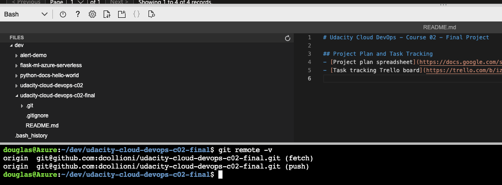
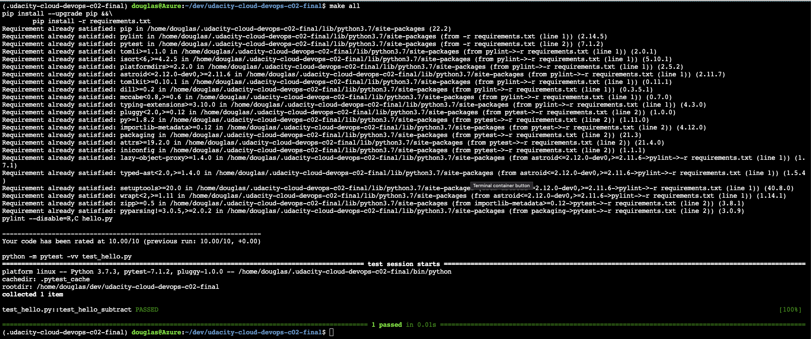
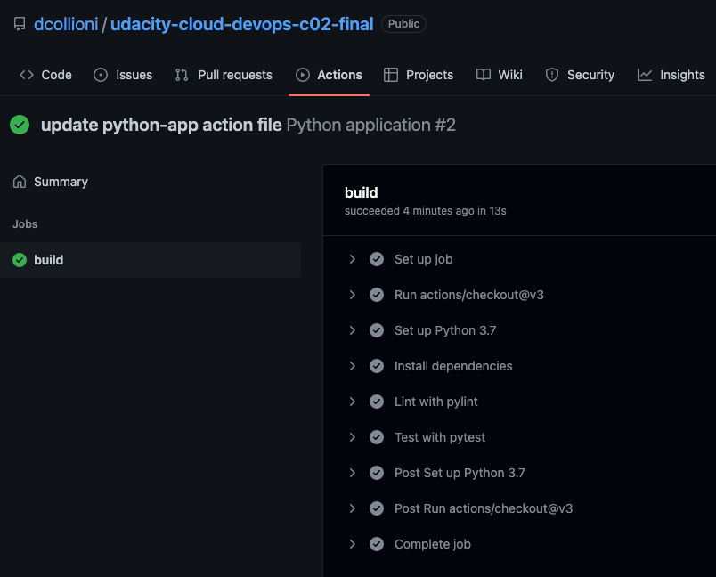

# Udacity Cloud DevOps - Course 02 - Final Project

## Project Plan and Task Tracking
- [Project plan spreadsheet](https://docs.google.com/spreadsheets/d/1p29UxxCbZ4jmfiDiYAPbk6N9hc05gtVK5Gno8hvmO3c)
- [Task tracking Trello board](https://trello.com/b/iziwVR8V/build-a-ci-cd-pipeline)

## Azure Cloud Shell
- 

## Setup
1. Create a Python virtual environment:
    ```sh
    make setup
    ```

1. Activate the virtual environment:
    ```sh
    source ~/.udacity-cloud-devops-c02-final/bin/activate
    ```

1. Deactivate the virtual environment:
    ```sh
    deactivate
    ```

## Install, Lint and Test
1. Run install, lint and tests:
    ```sh
    make all
    ```

    The result should look like that:
    

## GitHub Action Build
1. The app build is setup on the GitHub Actions:
    - https://github.com/dcollioni/udacity-cloud-devops-c02-final/actions

1. The result of a successful build workflow should look like that:
    

---
[](https://github.com/dcollioni/udacity-cloud-devops-c02-final/actions/workflows/python-app.yml)
